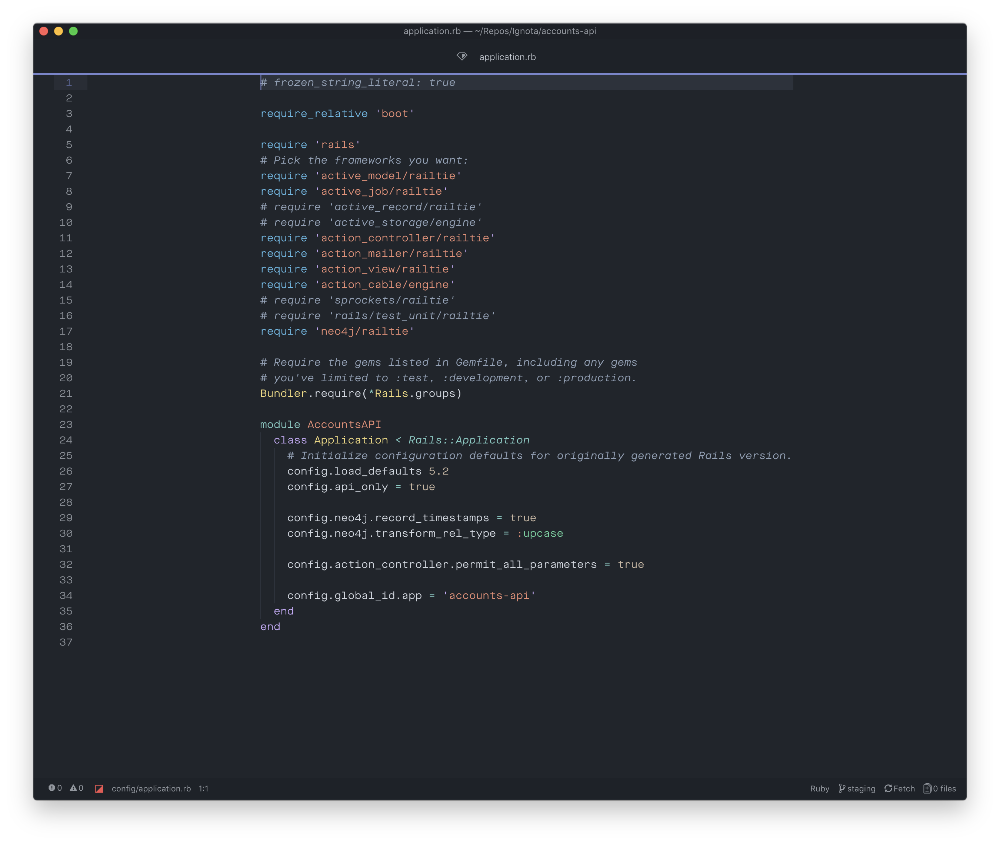

# Better Behavior Syntax: An (improved!) Atom port of Behave.
Better Behavior is an Atom syntax theme originally based on [fnky's Behave syntax](https://github.com/fnky/behave-theme) for TextMate. This version adds additional highlighting to a number of familiar languages, yielding a more colorful and friendly developer experience. _But don't take my word for it..._

(Pictured with [Atom Material UI](https://github.com/atom-material/atom-material-ui) and [Maison Neue Mono](https://www.milieugrotesque.com/typefaces/maison_neue/subfamilies/1159).)

## Babel/JavaScript

## CSSish

## GFM

## LaTeX

## Ruby

## TSX

## Contributing
Work is ongoing to add additional customizations for additional languages; if you should happen to beat me to one, pull 'er, patch 'er, and PR 'er.
